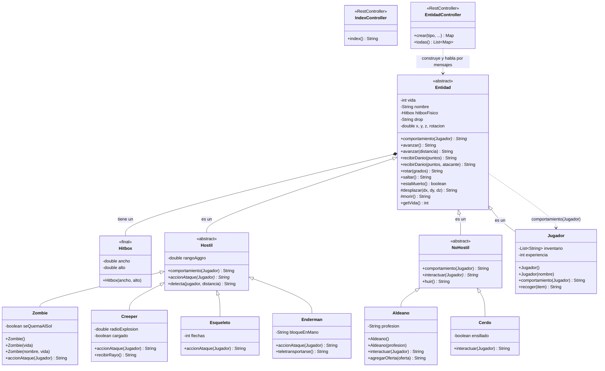

# mfdc-taller-git-2026

Servicio HTTP (Spring Boot) con el modelado de **Minecraft** para el ejercicio
POO-06 — *Revisión, paquetes, constructores y sobrecarga*,
Lenguaje de Programación 3 (CYT646).

- **Alumno:** MFDC
- **Usuario de GitHub:** [Cemelele](https://github.com/Cemelele)
- **Comisión:** CYT646 F — trabajo individual
- **Guía del taller:** [docs/TALLER_GIT.md](docs/TALLER_GIT.md)
- **Especificaciones aplicadas a este dominio:** [docs/ESPECIFICACIONES-POO-06.md](docs/ESPECIFICACIONES-POO-06.md)
- **Bitácora de uso de IA:** [BITACORA.md](BITACORA.md)

## Commit de la solución

Código, tests y documentación de la entrega:
<https://github.com/Cemelele/mfdc-taller-git-2026/commit/b42ec31dd0133acf0f5fa062203fec8141e0aeea>

## Licencia

[Apache License 2.0](LICENSE): se puede usar, modificar y distribuir (incluso
comercialmente) acreditando el origen y sin garantías.

## Cómo levantar el servicio

Requisitos: JDK 21.

```bash
./mvnw spring-boot:run
```

Queda en `http://localhost:8080`. Para detenerlo: `Ctrl+C`.

## Endpoints

| Método y ruta | Controller | Qué hace |
|---|---|---|
| `GET /` | `IndexController` | Confirma que el servicio está vivo |
| `GET /entidad/{tipo}` | `EntidadController` | Construye la entidad desde la URL y responde JSON |
| `GET /entidades` | `EntidadController` | Lista todas las entidades, cada una con su comportamiento |

Tipos válidos: `creeper`, `zombie`, `esqueleto`, `enderman`, `cerdo`, `aldeano`.

Parámetros de `GET /entidad/{tipo}`:

| Parámetro | Default | Qué alimenta |
|---|---|---|
| `jugador` | `""` | `new Jugador()` si está vacío, si no `new Jugador(nombre)` — constructores sobrecargados |
| `vida` | `0` | `new Zombie()` si es 0, si no `new Zombie(vida)` — constructor sobrecargado |
| `profesion` | `""` | `new Aldeano()` si está vacío, si no `new Aldeano(profesion)` — constructor sobrecargado |
| `danio` | `0` | `recibirDanio(danio)` — mensaje sobrecargado |
| `atacante` | `""` | Si viene, usa `recibirDanio(danio, atacante)` — la otra sobrecarga |
| `distancia` | `2.0` | `avanzar(distancia)` — mensaje sobrecargado (también existe `avanzar()`) |
| `item` | `""` | Lo recoge el jugador antes de la interacción |

```bash
curl "localhost:8080/entidad/zombie?vida=35&danio=10&atacante=Creeper"
curl "localhost:8080/entidad/aldeano?profesion=Herrero"
curl "localhost:8080/entidades"
curl -i "localhost:8080/entidad/creeper?danio=-5"   # 400: la clase rechaza el daño negativo
```

Si un valor rompe una regla del dominio, la **clase** lo rechaza con una
`IllegalArgumentException` y el controller la informa como HTTP 400.

## Cómo probar

```bash
./mvnw test                 # 17 tests: dominio + HTTP (MockMvc)
./mvnw spring-boot:run      # levanta el servicio
```

## Estructura de paquetes

Sigue el template [alefq/lp3-template-tp](https://github.com/alefq/lp3-template-tp/tree/main/src/main/java/py/edu/uc/lp3):

```text
src/main/java/py/edu/uc/lp3/
├── Application.java              ← solo arranca Spring Boot
├── domain/                       ← todo el modelado (sin HTTP)
│   ├── Entidad.java              clase base abstracta
│   ├── Hostil.java               abstracta, agrega accionAtaque() abstracto
│   ├── NoHostil.java             abstracta, agrega interactuar() abstracto
│   ├── Hitbox.java               inmutable, compuesto por Entidad
│   ├── Jugador.java
│   ├── Zombie.java  Creeper.java  Esqueleto.java  Enderman.java
│   └── Aldeano.java  Cerdo.java
└── rest/controller/              ← solo la capa HTTP
    ├── IndexController.java      GET /
    └── EntidadController.java    GET /entidad/{tipo}, GET /entidades
```

## Diagrama de clases



`*` marca métodos abstractos. La línea `Entidad <|-- Hostil` y
`Entidad <|-- NoHostil` son las dos clases hijas que **sobreescriben**
`comportamiento(Jugador)`; `Jugador` también lo implementa por su cuenta.
A su vez, cada tipo concreto implementa el gancho de su padre
(`accionAtaque` o `interactuar`).

## Sobrecarga y sobreescritura

### Sobreescritura (herencia: misma firma, clases distintas)

La clase base `Entidad` declara el método **abstracto**
`comportamiento(Jugador)`: algo que todas las entidades tienen que saber
hacer, pero que el padre no puede resolver porque cada tipo responde distinto.

- `Hostil.comportamiento(Jugador)` lo resuelve activándose con
  `accionAtaque(objetivo)`.
- `NoHostil.comportamiento(Jugador)` lo resuelve con `interactuar(objetivo)`.
- `Jugador.comportamiento(Jugador)` responde con su propia experiencia e inventario.

Mismo nombre, misma firma, implementación propia en cada clase: la que se
ejecuta se decide en tiempo de ejecución según el objeto real. El controller
nunca pregunta "¿de qué tipo es?": le pide `comportamiento(objetivo)` al tipo
padre y el texto lo escribe la clase hija. En el nivel concreto sigue pasando
lo mismo: `Zombie.accionAtaque` golpea a cuerpo a cuerpo, `Creeper.accionAtaque`
explota, `Esqueleto.accionAtaque` dispara una flecha.

### Sobrecarga (misma clase, otra lista de argumentos)

Mismo nombre de mensaje dentro de la **misma clase**, con otra lista de
argumentos. Elige el compilador, según los datos que se pasan:

| Clase | Firma | Cuándo se usa |
|---|---|---|
| `Entidad` | `avanzar()` | sin datos: paso por defecto de 1 bloque |
| `Entidad` | `avanzar(double distancia)` | con la distancia exacta |
| `Entidad` | `recibirDanio(int puntos)` | solo los puntos de daño |
| `Entidad` | `recibirDanio(int puntos, String atacante)` | además, quién ataca |
| `Zombie` | `Zombie()`, `Zombie(int vida)`, `Zombie(String, int)` | constructores simples y sobrecargados |
| `Jugador` | `Jugador()` (Steve), `Jugador(String nombre)` | idem |
| `Aldeano` | `Aldeano()` (Granjero), `Aldeano(String profesion)` | idem |

Las sobrecargas delegan entre sí (`avanzar()` llama a `avanzar(1.0)`,
`Zombie(int)` llama a `this("Zombie", vida)`) para no duplicar la regla.
Desde la URL se ven directo: `?vida=35` construye con el constructor
sobrecargado y `?atacante=Creeper` elige la sobrecarga de `recibirDanio`.

### Cómo distinguirlas

- **Sobrecarga**: una sola clase, mismo nombre, *distinta lista de
  argumentos*. Se resuelve en **compilación**.
- **Sobreescritura**: clase hija repite la *misma firma* de un método de la
  padre. Se resuelve en **ejecución**, con el objeto real.

### Pregunta de anclaje: ¿puede el controller dejar el objeto inválido?

No. `vida` y el resto del estado son **privados** y `Entidad` no expone
setters: el estado solo cambia por constructores y mensajes de la propia
clase. Si el controller intentara algo como `entidad.setVida(0)` no
compilaría; y si manda un valor ilegal por la URL (`?danio=-5`), la clase
lanza `IllegalArgumentException` y el controller lo devuelve como HTTP 400,
sin haber tocado el objeto.

## Tests

```text
src/test/java/py/edu/uc/lp3/
├── ApplicationTests.java                  arranque del contexto
├── domain/EntidadTest.java                sobreescritura, sobrecarga, constructores, invariantes
└── rest/controller/EntidadControllerTest.java   GET / y construcción desde la URL por HTTP
```
